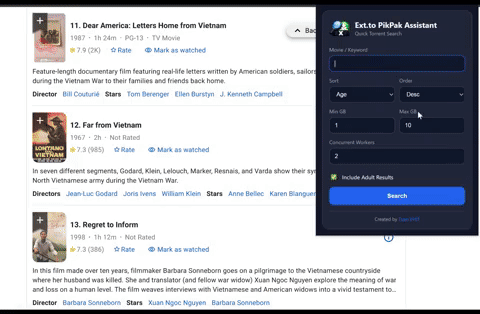
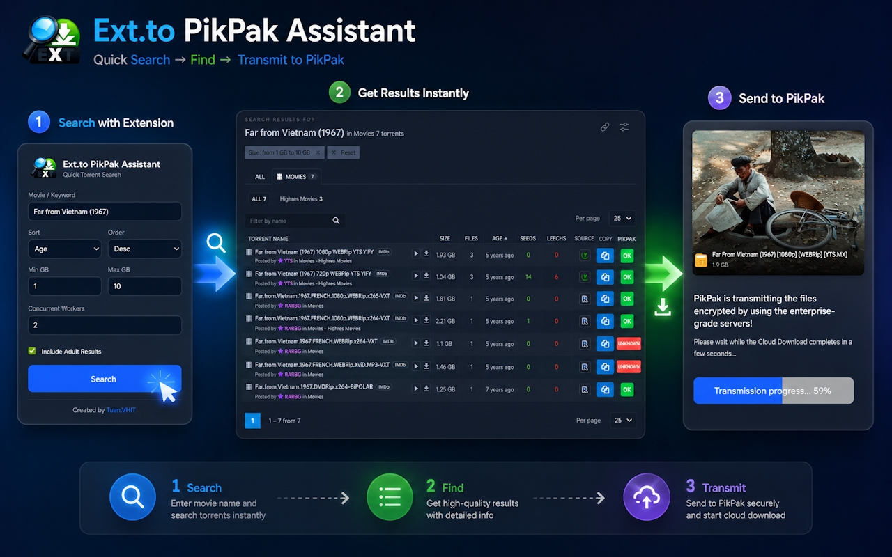
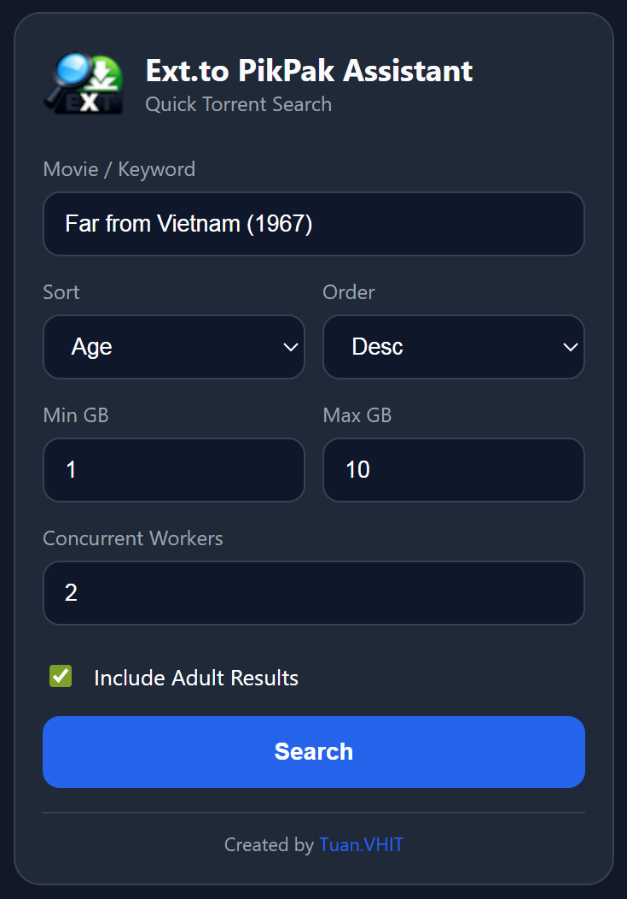
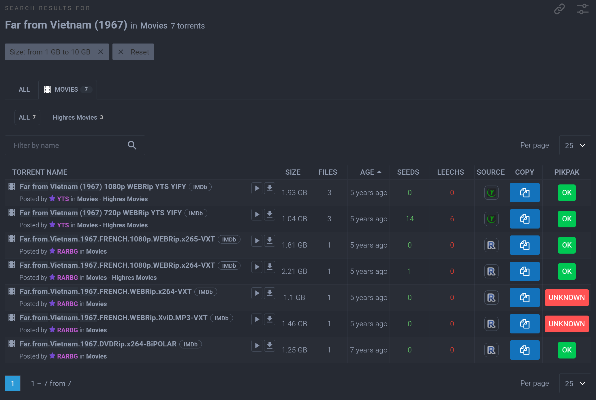
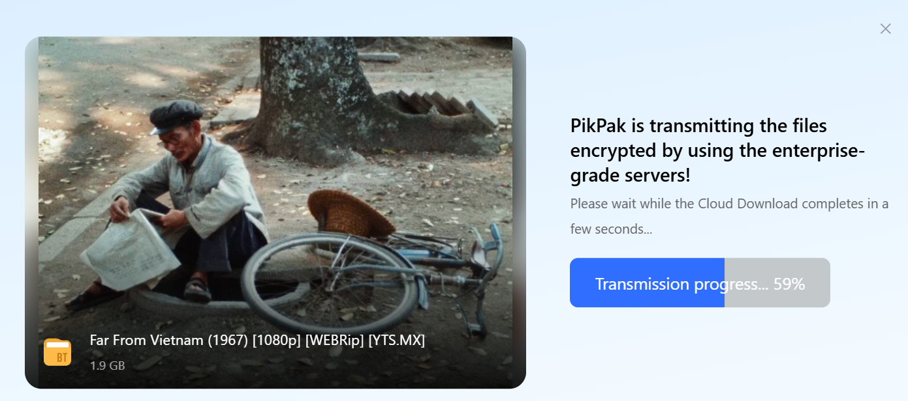

# Ext.to PikPak Assistant

A lightweight browser extension designed to automate the workflow between [Ext.to](https://ext.to) and [PikPak](https://mypikpak.com). Say goodbye to manual tab-switching and repetitive copying.

## 🎥 Demo

**How it works:**

| 1. Search Easily | 2. Instant Status Check | 3. One-Click Add |
| :---: | :---: | :---: |
|  |  |  |
| *Find movies directly from the extension* | *Know if the file is on your cloud* | *Add to your PikPak with one click* |

## 🚀 Why this extension?
Tired of the manual cycle? I built this tool to fix my own frustration with searching and saving torrents.

**The old way:**
Search → Open Torrent → Copy Magnet → Open PikPak → Paste → Check Status → Repeat.

**The new way:**
Search → **One-Click Add.**

## ✨ Key Features
- **Auto-Search:** Search directly from the extension icon.
- **Persistent Filters:** Set your preferred quality/size filters once, and they stay forever.
- **Live Status Check:** Instantly see if a torrent is already available on your PikPak cloud.
- **One-Click Add:** Save files to PikPak without leaving the search page.
- **Bulk Action:** Copy magnets or open links with ease.

## 📥 Installation
### Option 1: Chrome Web Store (Recommended)
Install the extension directly from the Chrome Web Store for automatic updates and easy management:
👉 **[Install Ext.to PikPak Assistant](https://chromewebstore.google.com/detail/extto-pikpak-assistant/kohmfeooipmkkgjlddfpeognbcgalnoi)**

### Option 2: Developer Mode (Manual)
1. **Download** the latest release from the [Releases page](https://github.com/tuanvhit/Ext.to-PikPak-Assistant/releases).
2. **Extract** the `.zip` file to a folder on your computer.
3. Open your browser and go to `chrome://extensions`.
4. Turn on **Developer mode** (top right corner).
5. Click **Load unpacked** and select the folder you just extracted.

## 💡 Feedback & Contributions
This tool was built to solve my personal needs, but I'd love to hear how it works for you! 
- Found a bug? [Open an issue](https://github.com/tuanvhit/Ext.to-PikPak-Assistant/issues).
- Have a feature request? [Start a discussion](https://github.com/tuanvhit/Ext.to-PikPak-Assistant/discussions).

## 📄 License
This project is licensed under the **MIT License**. See the [LICENSE](LICENSE) file for details.

---
*Created with ❤️ by [TuanVHIT]*
